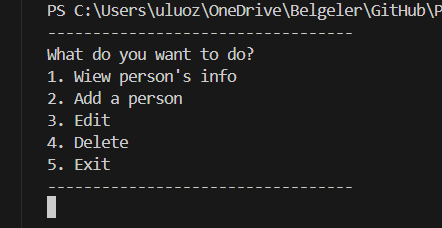
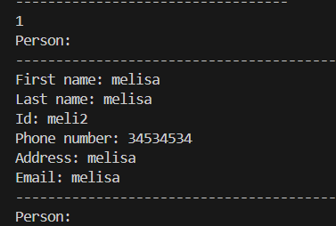
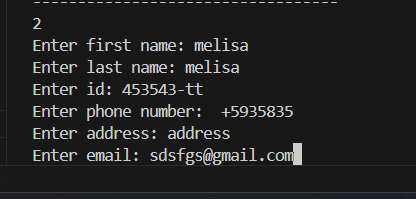
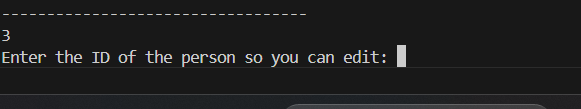
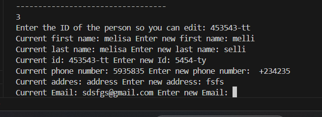
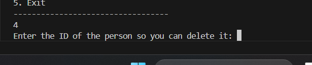
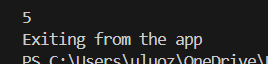

# PROJECTJ

# ContactsApp

A simple Java based console application for managing contacts. It allow user to:

-Add new contacts
-Editing existing contacts
-Delete contacts
-View a list of contacts
-All changes are saved in a CSV file [contacts.csv].

This application does not uses graphical user interface (GUI). Instead this application is command-line interface

# Features

- **View**: View the details of all stored contacts.
- **Add**: Add a new person/contacts to the list.
- **Edit**: Edit the details of an existing contact by providing its ID.
- **Delete**: Delete a contact by providing its ID:
- **Save**: All contacts are saved in the "contacts.csv" file.

# Used technologies

- Java
- File I/O (csv file storage)
- Console-based UI

# Requirements

- JDK 8 or higher
- Text based console interface

# How to setup

**CLONE OR DOWNLOAD** the repository

git clone https://github.com/youka00/PROJECTJ.git

**How to run?**

javac ContactsApp.java personInfo.java

java ContactsApp

# How to use

Choose what you want to do.

- **Option 1**: View all contacts information
- **Option 2**: Add a new contacct by entering details (First name, last name, ID, phone number, address and email).
- **Option 3**: Edit an existing contacts by specifying ID.
- **Option 4**: Delete a contact by specifying ID.
- **Option 5**: Exit the application.

For example:

1.
     

2.
    

3.
    

    

4.
    

5.
    

